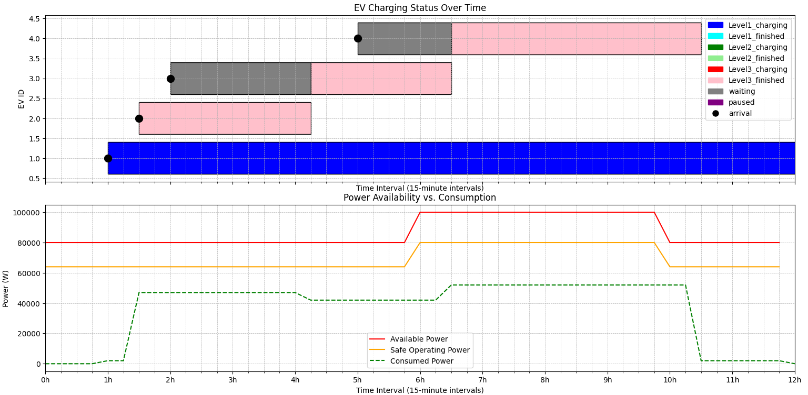
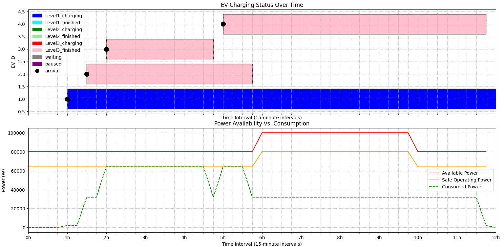

## Energy Management System README

Welcome to the Energy Management System project! This system is designed to simulate and optimize energy distribution between HVAC systems and electric vehicle (EV) charging stations within a building. Whether you're looking to understand energy flows, optimize usage, or simulate different power management strategies, this tool is for you.

### Features

- **Simulation Interface**: Easy-to-use graphical interface for setting up and monitoring simulations.
- **MPC and Default Orchestrator Options**: Choose between using a Model Predictive Control (MPC) orchestrator or a default setting with no orchestrator to see how different strategies affect energy usage.
- **Dynamic Interaction**: Add, modify, or delete vehicle entries in the simulation to test various scenarios.
- **Visualization Tools**: Built-in plotting tools to visualize the results of simulations, showing both real-time and historical data.

### Getting Started

#### Prerequisites

Before running the simulation, you will need to install Python and the necessary libraries. The project is built with Python 3.8+ in mind. Here’s how to set up your environment:

1. **Clone the repository**:
   ```bash
   git clone https://
   cd 
   ```

2. **Install dependencies**:
   Navigate to the project directory where the `requirements.txt` file is located and run:
   ```bash
   pip install -r requirements.txt
   ```
   This command installs all the required Python packages.

#### Running the Simulation

To start the simulation, run the interface Python script. This will open the graphical user interface:

```bash
python interface.py
```

### How to Use the Interface

1. **Launch the Application**: Start the application by running the main script. The GUI will open with default settings pre-loaded.

2. **Configure Settings**:
   - **Energy Settings**: Input peak and off-peak power settings directly through the interface.
   - **Device Management**: Adjust settings for HVAC and charging stations as needed.
   - **Simulation Duration**: Adjust the duration of the simulation as needed.

3. **Modify EV Entries**:
   - **Add New EVs**: Use the 'Add Car' button to include new electric vehicles into the simulation.
   - **Delete EVs**: Select an EV entry and use the 'Delete' icon to remove it.
   - **Edit EVs**: Double-click on an existing entry to modify its details.

4. **Choose an Orchestrator**:
   - **MPC Orchestrator**: Select this option for simulations that use Model Predictive Control strategies.
   - **None**: Choose this if you do not wish to use any orchestrator, to observe the system’s performance without advanced optimization.

5. **Run Simulation**: Click 'Start Simulation' to begin. The system will process the input data and display the results graphically.

6. **View Results**: Check the plots for detailed visual feedback on how the energy is being utilized over time in response to your configurations.


## Default Example Explanation

### Scenario Overview

The default example in our Energy Management System simulation provides an insightful demonstration of how different orchestrator settings can impact the performance and efficiency of energy distribution between devices, particularly in an environment with HVAC systems and electric vehicle (EV) charging stations.

### None Orchestrator Setting

Under the "None" orchestrator setting, the system does not employ any advanced algorithms to optimize or manage energy distribution. This scenario often leads to suboptimal usage of available resources, as demonstrated in the default setup:

- **Observation**: When using the "None" setting, the second electric vehicle (EV), which requires a high power level (Level 3 charging), experiences significant delays. Despite the availability of power and an unoccupied charging spot, the system fails to start charging this EV immediately.
- **Reason**: The system under the "None" setting lacks the capability to dynamically allocate available power. As a result, the EV must wait until other ongoing processes are completed, or until the system manually reallocates resources to accommodate high-power demands.



### MPC Orchestrator Setting

Switching to the "MPC" orchestrator setting, the system leverages Model Predictive Control algorithms to intelligently manage and distribute power based on predicted demands and operational constraints.

- **Enhanced Management**: With MPC, the system predicts energy needs and dynamically adjusts allocations to optimize utilization across all devices, including EV charging stations and HVAC systems.
- **Specific Outcome**: In the same scenario, MPC allows the second EV to begin charging immediately by orchestrating the exact amount of power required between specific specifications of EVs, even when energy resources are limited.
- **Result**: This leads to more efficient energy usage, reduced wait times, and enhanced overall performance, demonstrating the effectiveness of using advanced control strategies in complex systems.

  


### Conclusion

This example clearly illustrates the advantage of employing an advanced orchestrator like MPC over using no orchestration. Users are encouraged to explore these settings to see firsthand the impact of each on energy management efficiency.


### Contribution

...

### License

...

